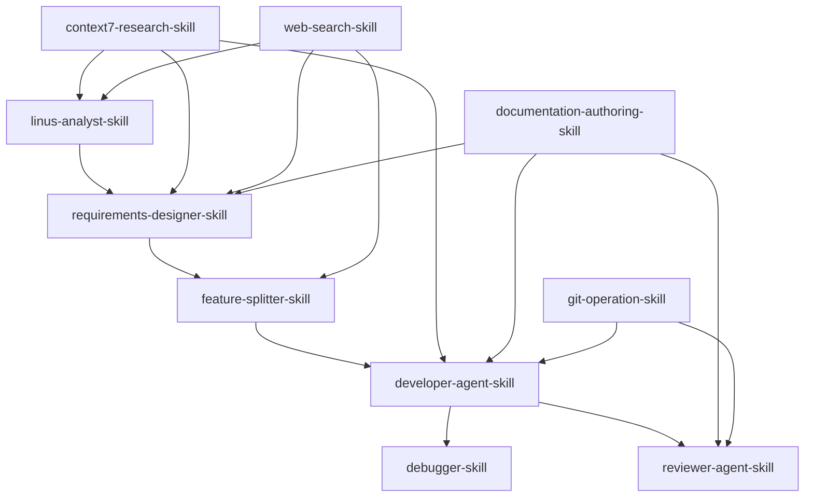

# AI Agent Skills 系統 - 最終版本

## 🎯 系統概述

本系統將現有的AI Agent開發指南完全轉換為模組化的 **Skills 系統**，保留所有核心哲學和原則，同時提供更靈活、可組合的執行架構。

## 🏗️ 檔案結構

```
skills/
├── skills-system-design.md          # 系統設計規範
├── linus-analyst-skill/             # 需求分析技能
│   ├── SKILL.md
│   ├── prompts/
│   │   ├── main.md
│   │   ├── examples.md
│   │   └── templates.md
│   ├── test-cases/
│   │   ├── input-validation.md
│   │   ├── output-verification.md
│   │   └── integration-tests.md
│   └── meta/
│       ├── dependencies.md
│       └── confidence-matrix.md
├── requirements-designer-skill/    # 需求設計技能
├── feature-splitter-skill/         # 功能拆解技能
├── developer-agent-skill/          # 開發技能
├── reviewer-agent-skill/           # 審查技能
├── debugger-skill/                 # 除錯技能
├── context7-research-skill/        # 文件查詢技能
├── git-operation-skill/            # 版本控制技能
├── web-search-skill/               # 網路搜尋技能
└── documentation-authoring-skill/  # 文件撰寫技能
```

## 🔗 技能依賴關係



## 🎯 核心技能介紹

### 1. Linus Analyst Skill
**職責**: 需求分析與可行性判斷
**信心水準**: 高 (≥90%)
**輸出**: 分析報告、Go/No-Go決策
**整合**: 所有設計階段的輸入基礎

### 2. Requirements Designer Skill
**職責**: 需求規格與技術設計
**信心水準**: 高 (≥90%)
**輸出**: requirements.md、design.md
**整合**: 資料結構優先設計、介面穩定性

### 3. Feature Splitter Skill
**職責**: 功能拆解與任務規劃
**信心水準**: 高 (≥90%)
**輸出**: tasks.md、任務清單
**整合**: 資料→業務→介面原則

### 4. Developer Agent Skill
**職責**: 程式開發與測試
**信心水準**: 高 (≥90%)
**輸出**: 源碼、changes.md、review.md
**整合**: TDD開發循環、簡單至上

### 5. Reviewer Agent Skill
**職責**: 程式碼與文件審查
**信心水準**: 高 (≥90%)
**輸出**: 審查報告、品味評分
**整合**: Level 1/2/3審查等級

### 6. Debugger Skill
**職責**: 問題定位與修復
**信心水準**: 高 (≥90%)
**輸出**: Bug報告、修復程式碼
**整合**: Root Cause分析、修復驗證

## 🔧 輔助技能介紹

### 7. Context7 Research Skill
**職責**: 文件查詢與API研究
**信心水準**: 中等 (70-89%)
**輸出**: 文件摘要、API範例
**整合**: 支援所有分析與設計階段

### 8. Git Operation Skill
**職責**: 版本控制與CI/CD
**信心水準**: 高 (≥90%)
**輸出**: Git操作結果、CI/CD狀態
**整合**: 支援開發與審查階段

### 9. Web Search Skill
**職責**: 網路搜尋與資料收集
**信心水準**: 中等 (70-89%)
**輸出**: 搜尋結果、最佳實踐
**整合**: 支援需求分析和設計階段

### 10. Documentation Authoring Skill
**職責**: 文件撰寫與模板管理
**信心水準**: 高 (≥90%)
**輸出**: 標準化文件
**整合**: 所有文件輸出階段

## 📊 技能品質保證

### 1. 測試標準
- **輸入驗證**: 是否正確處理各種輸入格式
- **輸出驗證**: 是否符合定義的輸出介面
- **邊界測試**: 是否正確處理邊界情況
- **性能測試**: 是否符合執行時間預期

### 2. 審核標準
- **一致性**: 輸出是否符合專案慣例
- **正確性**: 邏輯是否正確
- **清晰度**: 輸出是否易於理解
- **遵循原則**: 是否符合Linus哲學

### 3. 整合測試
- **技能組合**: 技能間的無縫整合
- **上下文管理**: Context的正確使用和清理
- **錯誤處理**: 錯誤的正確處理和報告
- **性能評估**: 整體系統的性能表現

## 🚀 執行範例

### 範例1：新功能開發流程
```
1. Linus Analyst Skill
   - 分析需求：是否值得開發
   - 輸出：分析報告、Go/No-Go決策

2. Requirements Designer Skill
   - 設計規格：需求規格書、技術設計文檔
   - 輸出：requirements.md、design.md

3. Feature Splitter Skill
   - 拆解任務：將功能拆解為可執行子任務
   - 輸出：tasks.md、任務清單

4. Developer Agent Skill
   - 開發實作：TDD開發循環
   - 輸出：源碼、changes.md、review.md

5. Reviewer Agent Skill
   - 程式碼審查：品質把關
   - 輸出：審查報告、品味評分

6. Debugger Skill
   - 問題修復：定位和修復問題
   - 輸出：Bug報告、修復程式碼
```

### 範例2：Bug修復流程
```
1. Linus Analyst Skill
   - 分析問題：是否值得修復
   - 輸出：分析報告、修復決策

2. Debugger Skill
   - 問題定位：找出根本原因
   - 輸出：Bug報告、修復方案

3. Developer Agent Skill
   - 修復實作：實施修復方案
   - 輸出：修復程式碼、changes.md

4. Reviewer Agent Skill
   - 修復審查：驗證修復品質
   - 輸出：審查報告、批准狀態
```

## 📊 信心水準矩陣

| 技能 | 高信心 (≥90%) | 中信心 (70-89%) | 低信心 (<70%) |
|------|-------------|----------------|-------------|
| Linus Analyst | 需求分析、Go/No-Go決策 | 部分需求分析 | 召喚人類釐清需求 |
| Requirements Designer | 技術設計、規格撰寫 | 部分設計決策 | 召喚人類審核設計 |
| Feature Splitter | 任務拆解、優先級排序 | 部分任務劃分 | 召喚人類審核拆解 |
| Developer Agent | 程式開發、TDD循環 | 部分實作決策 | 召喚人類審核程式碼 |
| Reviewer Agent | 程式碼審查、品味評分 | 部分審查決策 | 召喚人類最終裁決 |
| Debugger | 問題定位、修復方案 | 部分除錯決策 | 召喚人類協助除錯 |

## 🎯 整合規範

### 1. 技能組合模式

#### 串聯模式 (Pipeline)
```
analyst-skill → designer-skill → splitter-skill → developer-skill → reviewer-skill
```

#### 平行模式 (Parallel)
```
├── reviewer-skill-1 (Code)
└── reviewer-skill-2 (Docs)
```

#### 分支模式 (Conditional)
```
if (confidence < 70%) {
    debugger-skill
} else {
    developer-skill
}
```

### 2. 上下文管理

#### 最小權限原則
- 每個技能只讀取執行任務所需的最小Context
- 避免過度載入Context，保持系統效率

#### 用完即丟原則
- 技能執行完畢後，Context不回流到主Agent
- 只回傳「結果 (Artifacts)」到主Session

### 3. 錯誤處理

#### 錯誤類型
- **輸入錯誤**: 處理無效的輸入格式
- **執行錯誤**: 處理執行過程中的錯誤
- **輸出錯誤**: 處理輸出結果的錯誤

#### 錯誤處理策略
- **恢復策略**: 嘗試自動恢復
- **降級策略**: 提供降級方案
- **報告策略**: 詳細記錄錯誤資訊

## 📈 績效指標

### 1. 技能品質指標
- **準確率**: 輸出結果的準確性
- **覆蓋率**: 處理情境的覆蓋程度
- **效率**: 執行時間和資源使用
- **品質分數**: 輸出品質的綜合評分

### 2. 系統績效指標
- **整體準確率**: 整個開發流程的準確性
- **交付時間**: 從需求到交付的時間
- **錯誤率**: 系統運行中的錯誤率
- **用戶滿意度**: 用戶對系統的滿意度

### 3. 改進指標
- **學習速率**: 系統改進的速度
- **適應能力**: 系統適應新需求的能力
- **維護成本**: 系統維護的成本
- **擴展性**: 系統擴展的難易程度

## 🔗 與現有系統的整合

### 1. 與 AGENTS.md 的整合
- **核心原則**: 所有技能都繼承 `AGENTS.md` 的核心原則
- **Linus 哲學**: 所有技能都遵循 Linus 的四大哲學
- **評分系統**: 所有技能都使用 +5/-9/+2/+0 評分系統

### 2. 與文件架構的整合
- **features/**: 技能輸出對應到功能開發記錄
- **tasks/**: 技能執行記錄對應到任務記錄
- **templates/**: 技能使用標準化模板

### 3. 與工作流的整合
- **標準流程**: 技能對應到標準AI任務執行流程
- **功能開發**: 技能對應到功能開發流程
- **任務類型**: 技能對應到不同任務類型

## 🎯 最終目標

建立一個**模組化、可組合、高品質**的技能系統，讓AI開發團隊能夠：

1. **高效協作**: 技能間無縫整合，減少Context切換成本
2. **品質保證**: 每個技能都經過嚴格測試，確保輸出品質
3. **靈活擴展**: 輕鬆新增或修改技能，適應不斷變化的需求
4. **透明可追蹤**: 每個決策都有記錄，確保可追溯性
5. **Linus 標準**: 所有輸出都符合Linus Torvalds的品質標準

這將成為AI開發團隊的**技能基礎設施**，確保所有代理都能以一致的方式運作，並達到Linus Torvalds的品質標準。