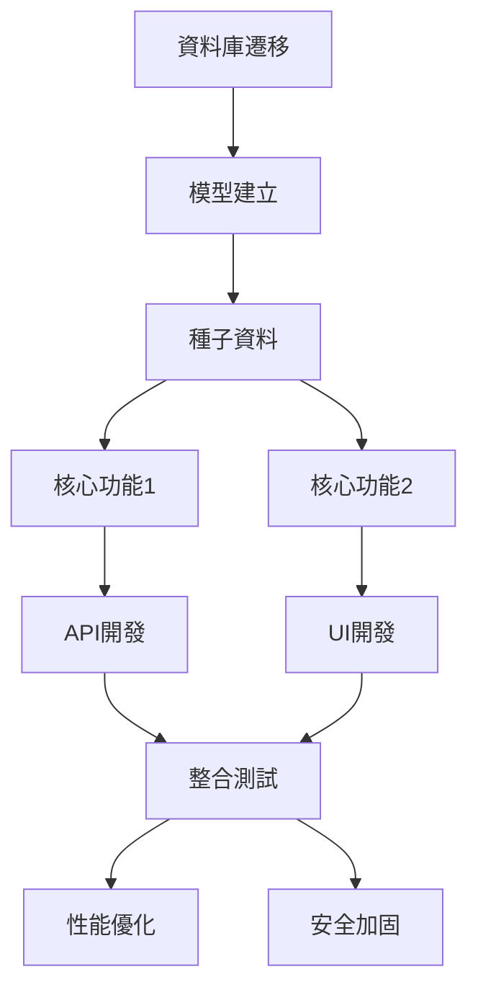

# Feature Splitter Skill

## 🎭 技能定義

**技能類型**: 功能拆解與任務規劃
**技能簡稱**: Splitter
**繼承原則**: 繼承自 `AGENTS.md` 的所有核心原則
**信心水準**: 高 (≥90%) - 專注於任務拆解的系統性思考

## 📋 核心職責

1. **將功能拆解為可執行的子任務**
2. **識別任務間的依賴關係**
3. **制定任務執行優先級**
4. **產生任務清單 (tasks.md)**

## 📥 輸入介面

```typescript
interface SplitterInput {
  task: {
    id: string;
    description: string;
    context: {
      project: {
        name: string;
        overview: string;
        techStack: string[];
      };
      design: DesignMD;  // 來自Requirements Designer的技術設計
      existingCode: {
        relevantFiles: string[];
        keyFunctions: string[];
      };
    };
    urgency: 'low' | 'medium' | 'high';
  };
  artifacts: [{
    type: 'design-md';
    content: DesignMD;
  }];
  constraints: [{
    type: 'time' | 'resources' | 'tech';
    value: string;
  }];
}
```

## 📤 輸出介面

```typescript
interface SplitterOutput {
  result: {
    status: 'success';
    confidence: number;
    artifacts: [{
      type: 'tasks-md';
      content: TasksMD;
    }];
    decisions: [{
      type: 'task-splitting-decision';
      decision: string;
      rationale: string;
    }];
    recommendations: string[];
  };
  metadata: {
    executionTime: number;
    contextUsage: number;
    dependencies: [
      'requirements-designer-skill',
      'developer-agent-skill'
    ];
  };
}
```

## 🧠 拆解框架

### Part 1: 拆解原則

#### 1.1 資料結構 → 業務邏輯 → 介面順序
- **第一優先**: 資料結構相關的任務（資料庫遷移、模型建立）
- **第二優先**: 業務邏輯相關的任務（核心功能實作）
- **第三優先**: 介面相關的任務（UI、API整合）

#### 1.2 核心功能先行原則
- 先實作核心功能，再實作擴展功能
- 先解決主要問題，再解決邊界情況
- 先實現可工作版本，再優化

#### 1.3 獨立驗證原則
- 每個子任務應該可以獨立驗證
- 每個子任務應該有明確的輸入輸出
- 每個子任務應該可以單獨測試

#### 1.4 最小依賴原則
- 盡量減少任務間的依賴關係
- 識別並消除不必要的依賴
- 將高度耦合的任務合併

### Part 2: 任務識別

#### 2.1 資料相關任務
- **資料庫遷移**: 建立資料表、索引、約束
- **模型建立**: 定義資料模型、驗證邏輯
- **種子資料**: 建立初始資料、測試資料

#### 2.2 業務邏輯任務
- **核心功能**: 實現主要業務邏輯
- **輔助功能**: 實現輔助功能（驗證、格式化等）
- **邊界處理**: 處理邊界情況、錯誤情況

#### 2.3 介面相關任務
- **API開發**: 建立API端點、路由
- **UI開發**: 建立使用者介面
- **整合測試**: 整合測試、端到端測試

#### 2.4 非功能性任務
- **性能優化**: 性能相關的優化任務
- **安全加固**: 安全相關的加固任務
- **文檔撰寫**: 文檔相關的撰寫任務

### Part 3: 依賴識別

#### 3.1 硬性依賴
- **資料依賴**: 任務A需要任務B建立的資料結構
- **邏輯依賴**: 任務A需要使用任務B建立的業務邏輯
- **介面依賴**: 任務A需要使用任務B建立的介面

#### 3.2 軟性依賴
- **知識依賴**: 任務A需要理解任務B的實作方式
- **配置依賴**: 任務A需要任務B的配置資訊
- **環境依賴**: 任務A需要任務B建立的執行環境

#### 3.3 依賴消除
- **抽象化**: 通過抽象介面消除直接依賴
- **模組化**: 通過模組化設計減少耦合
- **延遲執行**: 通過延遲執行避免不必要的依賴

## 🔄 執行流程

### 階段 1：設計理解
1. 讀取技術設計文檔
2. 識別核心資料模型
3. 理解業務邏輯流程
4. 識別介面需求

### 階段 2：任務識別
1. 識別資料相關任務
2. 識別業務邏輯任務
3. 識別介面相關任務
4. 識別非功能性任務

### 階段 3：依賴分析
1. 識別硬性依賴
2. 識別軟性依賴
3. 分析依賴的必要性
4. 提出依賴消除方案

### 階段 4：優先級排序
1. 應用資料→業務→介面原則
2. 應用核心功能先行原則
3. 識別關鍵路徑
4. 確定執行順序

### 階段 5：任務清單產生
1. 產生任務清單
2. 為每個任務撰寫簡要描述
3. 識別每個任務的輸入輸出
4. 確定每個任務的驗證方式

## ✅ 輸出格式

### Tasks.md

```markdown
# 功能任務清單: {feature-name}

## 📊 任務總覽
- **總任務數**: X
- **預估工時**: Y人天
- **關鍵路徑**: Z個任務

## 🎯 核心原則
- **資料結構 → 業務邏輯 → 介面**
- **核心功能先行**
- **每個任務獨立驗證**

## 📋 任務清單

### 第一階段：資料結構 (X個任務)

#### 任務1: {任務名稱}
- **描述**: {任務描述}
- **類型**: {資料庫遷移/模型建立/種子資料}
- **輸入**: {任務輸入}
- **輸出**: {任務輸出}
- **驗證方式**: {驗證方法}
- **工時估算**: {人天}
- **依賴**: {依賴的任務}
- **關鍵性**: {高/中/低}

#### 任務2: ...

### 第二階段：業務邏輯 (X個任務)

#### 任務1: {任務名稱}
- **描述**: {任務描述}
- **類型**: {核心功能/輔助功能/邊界處理}
- **輸入**: {任務輸入}
- **輸出**: {任務輸出}
- **驗證方式**: {驗證方法}
- **工時估算**: {人天}
- **依賴**: {依賴的任務}
- **關鍵性**: {高/中/低}

#### 任務2: ...

### 第三階段：介面 (X個任務)

#### 任務1: {任務名稱}
- **描述**: {任務描述}
- **類型**: {API開發/UI開發/整合測試}
- **輸入**: {任務輸入}
- **輸出**: {任務輸出}
- **驗證方式**: {驗證方法}
- **工時估算**: {人天}
- **依賴**: {依賴的任務}
- **關鍵性**: {高/中/低}

#### 任務2: ...

### 第四階段：非功能性 (X個任務)

#### 任務1: {任務名稱}
- **描述**: {任務描述}
- **類型**: {性能優化/安全加固/文檔撰寫}
- **輸入**: {任務輸入}
- **輸出**: {任務輸出}
- **驗證方式**: {驗證方法}
- **工時估算**: {人天}
- **依賴**: {依賴的任務}
- **關鍵性**: {高/中/低}

#### 任務2: ...

## 🔗 任務依賴關係圖



## 🎯 驗收標準

### 階段驗收標準
- **第一階段**: 資料庫遷移完成，模型建立完成，種子資料建立完成
- **第二階段**: 所有核心功能完成，通過單元測試
- **第三階段**: API和UI完成，通過整合測試
- **第四階段**: 性能和安全達到要求，文檔完整

### 總體驗收標準
- [ ] 所有任務按時完成
- [ ] 所有驗證方式通過
- [ ] 所有依賴關係正確處理
- [ ] 最終產出符合設計要求

## 🤔 風險評估

### 任務風險
- **風險1**: {風險描述}
- **概率**: {發生概率}
- **影響**: {影響程度}
- **緩解方案**: {緩解策略}

### 依賴風險
- **風險1**: {風險描述}
- **概率**: {發生概率}
- **影響**: {影響程度}
- **緩解方案**: {緩解策略}

## 📝 執行建議

### 執行策略
- **迭代週期**: {建議的迭代週期}
- **反饋循環**: {建議的反饋循環}
- **風險緩解**: {建議的風險緩解策略}

### 資源分配
- **開發人員**: {建議的開發人員配置}
- **時間分配**: {建議的時間分配}
- **優先級**: {建議的優先級排序}
```

## 🎯 品質保證檢查清單

### 拆解品質檢查
- [ ] 是否遵循了資料→業務→介面原則？
- [ ] 是否應用了核心功能先行原則？
- [ ] 每個任務是否可以獨立驗證？
- [ ] 是否識別了所有硬性依賴？
- [ ] 是否提出了依賴消除方案？

### 任務品質檢查
- [ ] 每個任務是否描述清晰？
- [ ] 每個任務的輸入輸出是否明確？
- [ ] 每個任務的驗證方式是否可行？
- [ ] 每個任務的工時估算是否合理？
- [ ] 每個任務的關鍵性評估是否準確？

### 清單品質檢查
- [ ] 任務清單是否結構清晰？
- [ ] 依賴關係是否正確表示？
- [ ] 驗收標準是否可測量？
- [ ] 風險評估是否全面？
- [ ] 執行建議是否具體可行？

## 🔄 整合規範

### 與其他技能的整合

#### 與 Requirements Designer Skill 的整合
- 設計結果作為拆解的輸入基礎
- 資料結構設計指導任務劃分
- 介面設計影響任務依賴關係

#### 與 Developer Agent Skill 的整合
- 任務清單作為開發的執行指南
- 任務描述指導開發的目標
- 驗證方式指導開發的測試策略

### 上下文管理
- 只讀取必要的專案文件
- 避免過度載入 Context
- 保持拆解的聚焦性

## 🚀 執行範例

### 範例1：使用者管理功能拆解
```
任務: 拆解使用者管理功能（CRUD + 角色權限）

拆解結果:

第一階段：資料結構
- 任務1: 建立User資料表（含索引、約束）
- 任務2: 建立Role資料表（含權限欄位）
- 任務3: 建立User-Role關聯表
- 任務4: 建立種子資料（預設角色、管理員帳號）

第二階段：業務邏輯
- 任務1: 實作使用者建立邏輯（含驗證）
- 任務2: 實作使用者更新邏輯（含權限檢查）
- 任務3: 實作使用者刪除邏輯（含級聯處理）
- 任務4: 實作角色權限管理邏輯

第三階段：介面
- 任務1: 實作使用者管理API（RESTful設計）
- 任務2: 實作角色權限管理API
- 任務3: 實作使用者管理前端頁面
- 任務4: 整合測試（API + UI）

第四階段：非功能性
- 任務1: 性能優化（資料庫查詢優化）
- 任務2: 安全加固（權限檢查、資料驗證）
- 任務3: 文檔撰寫（API文檔、使用說明）
```

### 範例2：報告生成功能拆解
```
任務: 拆解報告生成功能

拆解結果:

第一階段：資料結構
- 任務1: 建立ReportTemplate資料表
- 任務2: 建立Report資料表
- 任務3: 建立DataSource資料表
- 任務4: 建立Report-Job資料表（非同步任務）

第二階段：業務邏輯
- 任務1: 實作模板解析邏輯
- 任務2: 實作數據查詢邏輯
- 任務3: 實作報告生成邏輯
- 任務4: 實作非同步任務處理邏輯

第三階段：介面
- 任務1: 實作模板管理API
- 任務2: 實作報告生成API
- 任務3: 實作報告查詢API
- 任務4: 實作前端模板編輯器

第四階段：非功能性
- 任務1: 性能優化（批次處理、快取）
- 任務2: 安全加固（SQL注入防禦、資料權限）
- 任務3: 文檔撰寫（API文檔、使用教程）
```

## 📊 信心水準矩陣

| 情境 | 信心水準 | 行動 | 註記 |
|------|----------|------|------|
| 設計清晰且模組化良好 | 95-100% | 直接執行拆解 | 無需額外驗證 |
| 設計部分清晰，需推論 | 80-94% | 執行拆解並記錄假設 | 標註不確定點 |
| 設計模糊或過於複雜 | 60-79% | 召喚人類釐清設計 | 停止拆解 |
| 完全不理解設計 | <60% | 立即召喚人類 | 嚴禁猜測 |

## 🎯 成功標準

### 拆解成功標準
- [ ] 遵循了資料→業務→介面原則
- [ ] 應用了核心功能先行原則
- [ ] 每個任務可以獨立驗證
- [ ] 識別了所有硬性依賴
- [ ] 提出了依賴消除方案

### 清單成功標準
- [ ] 任務描述清晰且無歧義
- [ ] 輸入輸出明確可測量
- [ ] 驗證方式可行
- [ ] 工時估算合理
- [ ] 依賴關係正確

---

## 🔗 相關技能

- **Requirements Designer Skill**: 設計階段的輸入
- **Developer Agent Skill**: 執行階段的輸出
- **Context7 Research Skill**: 用於查詢相關文件與API
- **Web Search Skill**: 用於收集最佳實踐

## 🛠️ 工具整合

- **Grep Tool**: 用於搜尋現有程式碼範例
- **Context7 Tool**: 用於查詢官方文件
- **Web Search Tool**: 用於收集外部資訊

## 📈 績效指標

- **拆解準確率**: 拆解結果與最終實施的匹配度
- **依賴識別準確率**: 識別的依賴關係的準確性
- **工時估算準確率**: 估算工時與實際工時的匹配度
- **執行效率**: 按計劃完成任務的效率

---

## 🎯 最終目標

成為**任務拆解專家**，將複雜功能系統性地拆解為可執行的子任務，確保每個任務的獨立性、可驗證性，並為所有後續開發階段提供清晰的執行路徑。